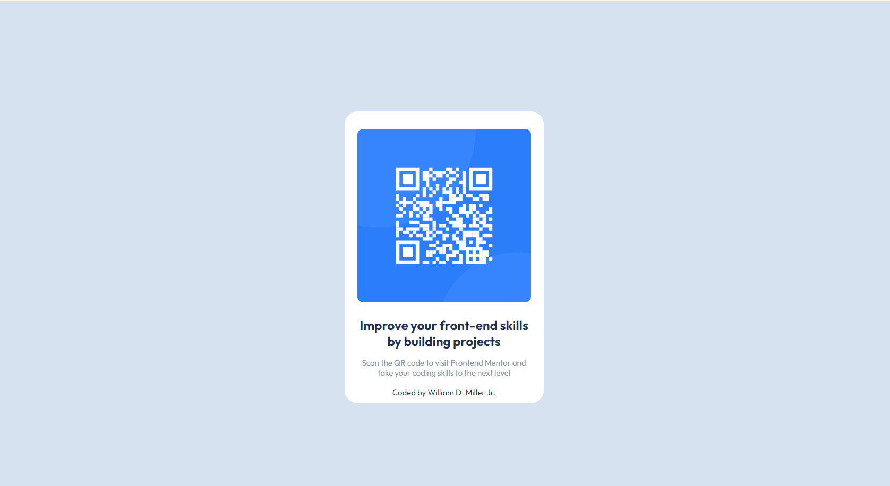

# Frontend Mentor - QR code component solution

This is a solution to the [QR code component challenge on Frontend Mentor](https://www.frontendmentor.io/challenges/qr-code-component-iux_sIO_H). Frontend Mentor challenges help you improve your coding skills by building realistic projects.

## Table of contents

- [Overview](#overview)
  - [Screenshot](#screenshot)
  - [Links](#links)
- [My process](#my-process)
  - [Built with](#built-with)
  - [What I learned](#what-i-learned)
  - [Continued development](#continued-development)
  - [Useful resources](#useful-resources)
- [Author](#author)

## Overview

This is my first Frontend Mentor Challenge.

### Screenshot



 

### Links

- Solution URL: [Add solution URL here](https://your-solution-url.com)
- Live Site URL: [QR CODE COMPONENT - GITHUB PAGE](https://bijiyiqi2017.github.io/QR-CODE-COMPONENT/)

## My process

Read the requirements, then I tried to figure it out as I went along. I hope to develop a better process in the future.

### Built with

- HTML5
- CSS3
- Flexbox
- Visual Studio Code
- Determination ~ to complete what I set out to do (this challenge)

### What I learned

I came into this only knowing a handful of simple html tags.

Git, GitHub, Visual Studio Code, and css was all new to me.

Something I really struggled with was box shadows. I discovered about box shadows while reading up on css card component. I got the hint from the challenge name and tried searching a few things.

Meta keywords I knew of long time ago. I also knew of a great website W3schools. I used the website to look up about viewport.

```html
<meta name="viewport" content="width=device-width, initial-scale=1.0" />
```

I am happy that I can use css to style the two text separtely calling the element id like below.

```css
#text-1 {
  font-size: 15px;
  text-align: center;
  color: #8a94a8;
  padding: 1rem 2rem;
}

#text-2 {
  font-size: 15px;
  text-align: center;
  color: #1f3251;
  padding: 0.1rem 2rem;
}
```

### Continued development

Just a few things I want to develop more understanding deeply.

- Flexbox
- Box Shadows
- CSS Units
- Git, & GitHub
- Visual Studio Code
- Dev Tools

### Useful resources

- [W3Schools ~ Box Shadows for Card Components](https://www.w3schools.com/howto/howto_css_cards.asp) - This helped me to use a box shadow example. I really liked this one and will use it going forward.
- [Flexbox Froggy Game](https://flexboxfroggy.com/) - This was an entertaining way to learn/practice using flexbox code. I'd recommend it to anyone still learning this concept.

## Author

- Frontend Mentor - [@bijiyiqi2017](https://www.frontendmentor.io/profile/bijiyiqi2017)
- Twitter/X - [@DayDayUp22](https://twitter.com/DayDayUp22)
